# Ad-hoc Portal (ARP) – User Guide & Process Flow

All ad-hoc reports must be logged via the Ad-hoc Reports Portal (ARP).

- **Access:** `http://192.169.210.67:2000/arp` (office network or VPN).
- **Home:** `http://192.169.210.67:2000/index`

---

## 1) Homepage

The homepage lists every request since launch. Use the filters/search to narrow results.

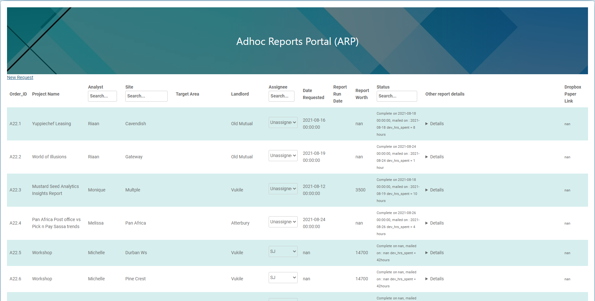

---

## 2) Log a New Request

Click **New Request** on the homepage to open the application form.

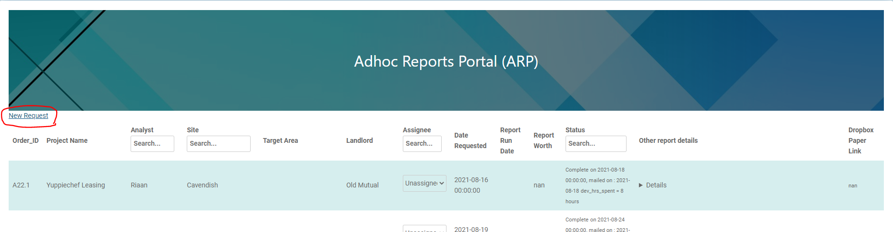

### Application Form


Fields with a red star (*) are required.

- **Project Name:** Free text to identify the event/reason.
- **Requestor Name:** Choose your name (used in the homepage “analyst” column).
- **Estimated Report Worth:** Rand value we would charge.
- **Site:** Choose the site; landlord/site code/name auto-fill.
- **Report Assignee:** Pick a specific analyst or leave unassigned for engineering to triage.
- **Date Requested:** Auto-populated.
- **Expected Date:** Agreed handover date, or the latest you need it (will be reset to assignment date + 3 days when assigned).
- **Other Report Request Details:** Add special instructions, filters, areas, hours, etc.—especially important when assigning to an engineer.

---

## 3) Build “Reports to Run”

Click **Reports to Run** to open the builder.

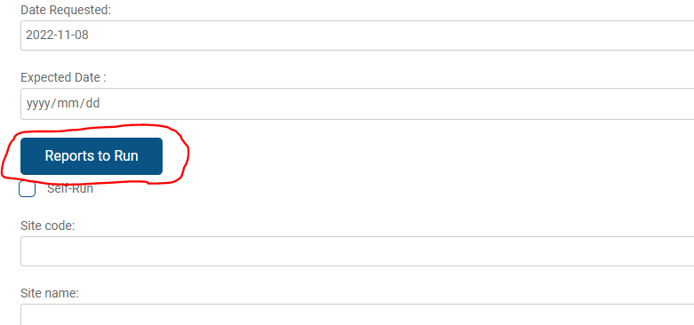
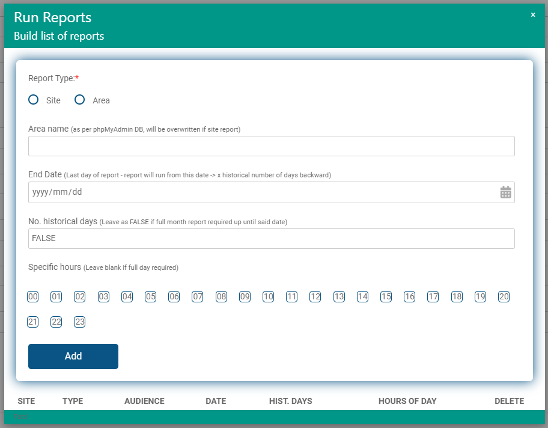

Fill in each report and click **Add** to place it in the list (“cart”).

- **Report Type:** Site or Area.
- **Area Name:** Area display name as in the FLE GUI (not codes like `S2_1`). You can combine multiple areas with a quoted, comma-separated list (e.g. `'Dischem','Clicks','Sorbet'`).
- **End Date:** Last day of the period to run up to.
- **Number of historical days:** How many days back from the End Date (add 1 to include the end date). Use `FALSE` for a full month from the 1st.
- **Specific hours:** Select every hour in the window (e.g. 12–15 → select 12,13,14,15).

Examples while building:

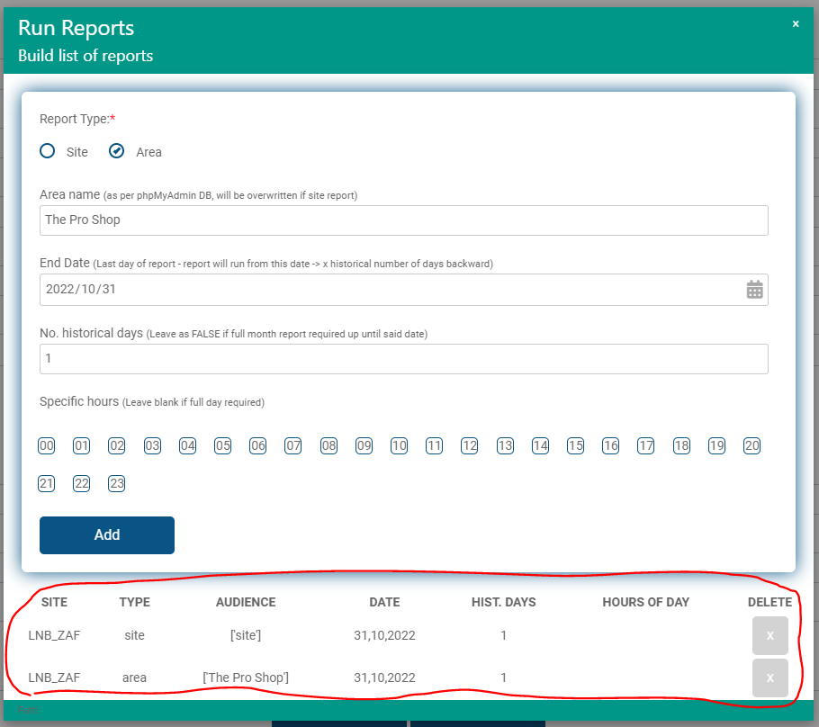
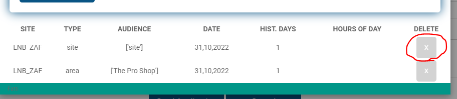
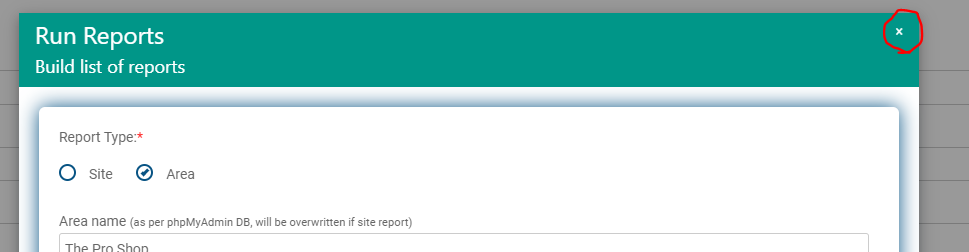

Notes:
- Add multiple reports per site in one request. Use separate requests per site.
- Remove mistakes with the grey **X**.
- Closing the modal keeps the list in your browser until you submit the form.

---

## 4) Execution Behavior

- **Assign to Self-run:** ARP automatically kicks off the reports (no extra checkbox needed).
- **Assign to an engineer:** ARP emails that engineer; nothing is auto-run, and you don’t need to notify them manually.

Buttons:
- **SEND application:** Saves, and if assigned to Self-run, immediately triggers the run.
- **CANCEL:** Discards and returns to the homepage.

---

## 5) Heatmap Requests

Use **Request Heatmap** to open the heatmap modal.

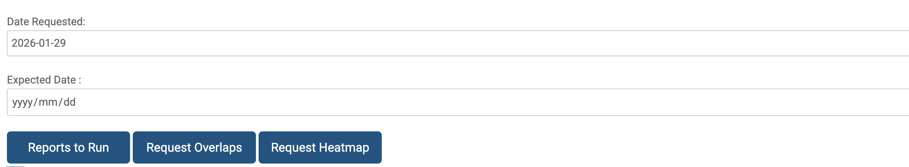
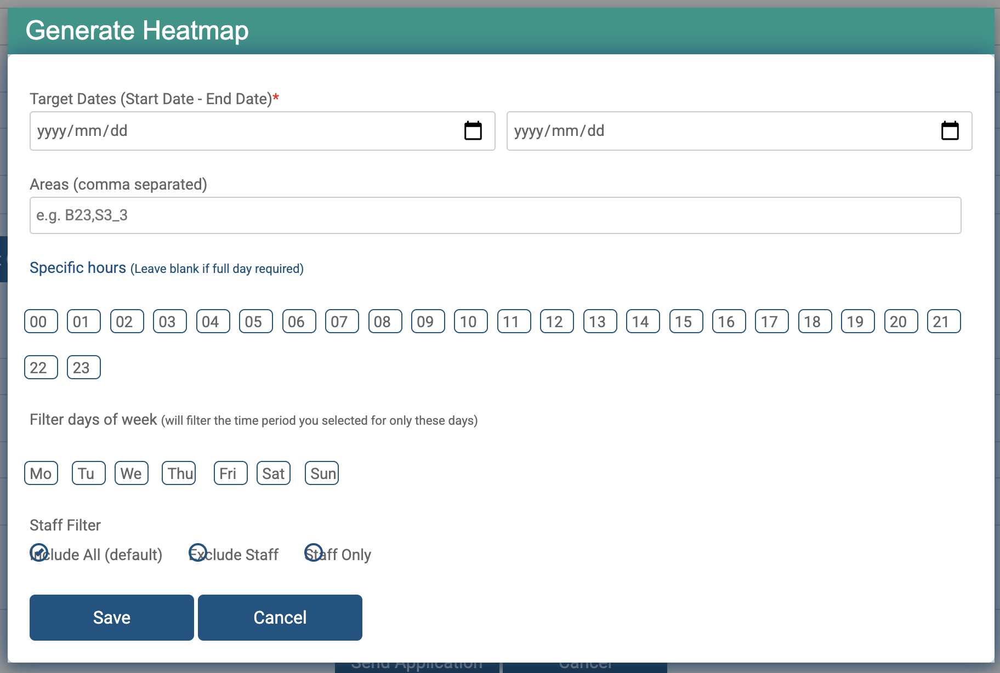

Fill the fields and click **Save** (heatmaps only run if you save):
- **Target dates:** Start and end date of the window.
- **Areas (comma separated):** Area names/codes to include.
- **Specific hours:** Optional hours; leave blank for full day.
- **Filter days of week:** Optional day filter.
- **Staff filter:** All (default), exclude, or staff-only.

When complete, ARP emails the generated heatmap to the requestor email.

---

## 6) Workflow & Statuses

### Notifications
When a request is logged, ARP emails the assignee (cc you) with all parameters.

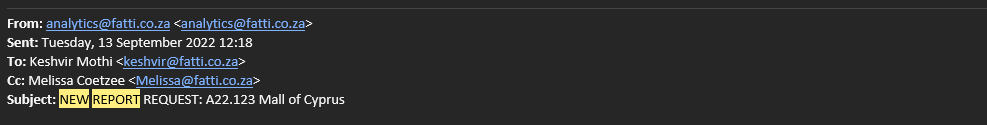

### Status progression
- **Requested:** Initial state after submission.
- **In Progress:** Engineer is working on it.
- **On Hold:** Waiting on prerequisites (data not ready, future-dated, etc.).
- **Report Ready:** Output exported to the site’s `pdf_out` folder, or data shared on the email thread.
- **Complete:** Analyst has mailed the client. ARP records the mailed date and locks further changes.

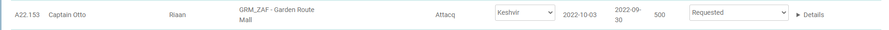

---

## 7) Escalations & Expectations

- **No need to email engineers by default.** The submission email is enough unless you’ve already coordinated with a specific engineer who needs extra details.
- **If nothing received after 72 hours:** Forward the original ARP submission email (or provide the ad-hoc code, e.g. `A25.1021`) to `eng@fatti.co.za`.
- **If you get a failure email:** Forward that failure email to `eng@fatti.co.za`.
- **Run-time varies:** Longer date ranges and large sites (e.g. `GWM_ZAF`, `MOA_ZAF`, `MOC_CYP`, `BAG_MUS`) take significantly longer than smaller sites.

---

## 8) Support & Retriggers

Manually re-trigger an ad-hoc report (replace the order ID):

```bash
python fatti_run_reports.py --src='arp' --arp_orderid='A23.258' --missing_only=0
```

---

## 9) Overlaps Feature (8 Jul 2025)

You can launch overlap reports directly from ARP.

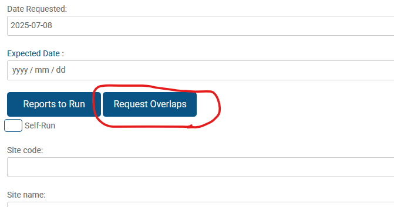
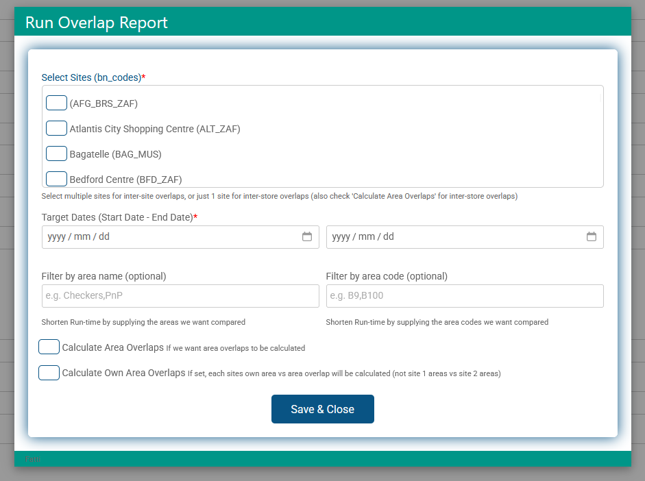

Fields:
- **Select Sites (bn_codes):** One or many sites to compare.
- **Target Dates:** Start and end dates for the overlap window.
- **Filter area by name:** List of store names to limit overlap scope (faster).
- **Filter area by code:** List of area codes (e.g. `B01`, `S5_1`) to limit scope.
- **Calculate Area Overlaps:** Also compute overlaps at area level (default is site-level only).
- **Calculate Own Area Overlaps:** When area overlaps are on, calculate overlaps per site independently (no cross-site overlaps); otherwise, overlaps are cross-site.

After **Save and close**, submit the main form. ARP auto-kicks off the overlap job and emails you when done. Outputs live in each site’s `pdf_out/overlaps` directory with filenames prefixed by your ad-hoc code (e.g. `A25.xxx`).

---

## Quick Reference

- Portal links: `/arp` (form), `/index` (dashboard)
- Network: office LAN or VPN
- Outputs: Site `pdf_out` (and `pdf_out/overlaps` for overlaps)
- Email trail: Initiated from `analytics@fatti.co.za` on submission
